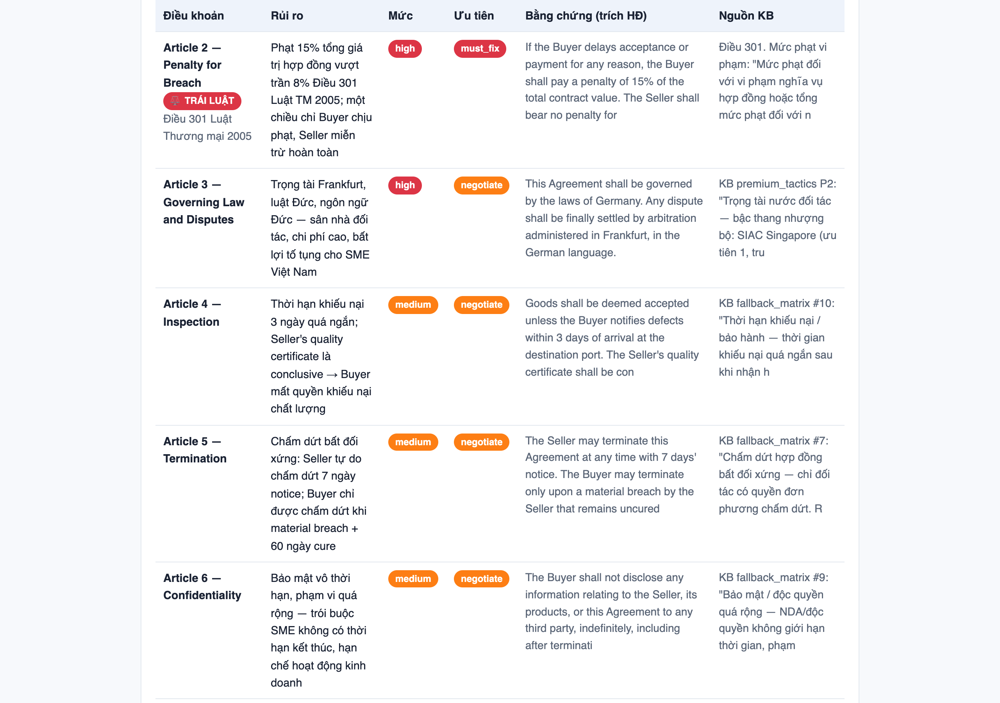
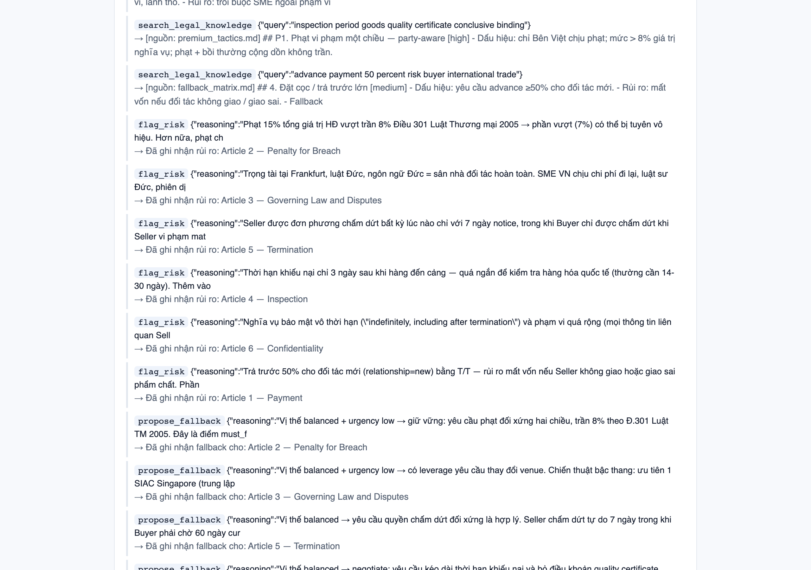
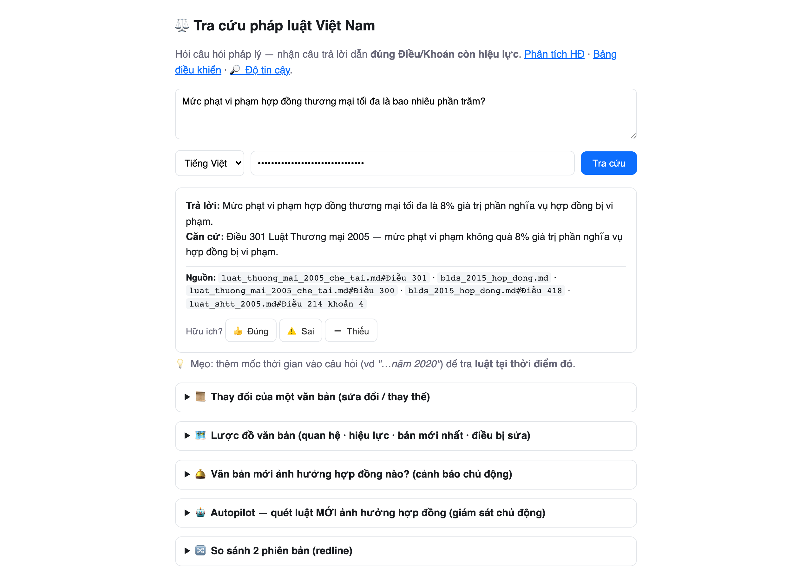
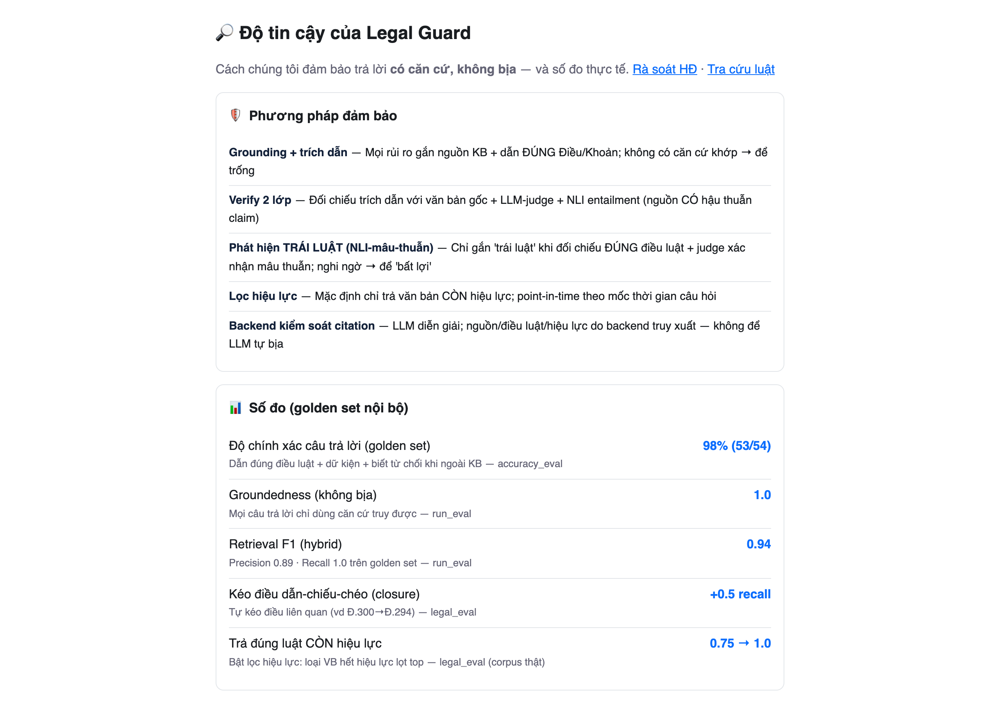

# Legal Guard — Autopilot Agent for Cross-Border Contract Risk

-brightgreen)


An AI agent that acts as an **outsourced legal department**: it reads an international commercial
contract, **flags risky and illegal clauses**, and proposes **position-aware negotiation tactics** —
then keeps a human in the loop before anything goes to the counterparty.

**Measured accuracy: 98.1% (53/54)** on a lawyer-style golden set spanning 12 Vietnamese legal
domains, run against the real Qwen stack — methodology and raw numbers are published at
[`/trust`](web/trust.html) (report: [`evaluation/accuracy_report.json`](evaluation/accuracy_report.json)).

> 🏆 Built for the **Qwen Cloud Hackathon — Autopilot Agent track**. Powered by Qwen models on Qwen
> Cloud, deployed on Alibaba Cloud. Proving ground: Vietnamese SMEs negotiating cross-border deals.
> 🇻🇳 Vietnamese readme: [`README.vi.md`](README.vi.md) · 🏗️ Architecture: [`docs/architecture.en.md`](docs/architecture.en.md) · ⚖️ Open-core boundary: [`docs/OPEN-CORE.md`](docs/OPEN-CORE.md)

## Why it fits "Autopilot Agent"

The track asks for an agent that **automates a real workflow end-to-end, handles ambiguous input,
invokes external tools, and incorporates human-in-the-loop checkpoints.** Legal Guard does exactly that:

- **End-to-end autonomy** — upload/paste a contract → the agent runs a **ReAct loop**, deciding which
  tools to call (`search_legal_knowledge`, `flag_risk`, `propose_fallback`, `request_human_review`)
  until it reaches a grounded conclusion, recording every step in a `trace`.
- **Self-critique** — after flagging risks the agent verifies its own findings (evidence must exist in
  the contract + a judge confirms each risk is supported by retrieved law) and marks unverified ones.
- **Proactive autopilot** — `POST /monitor/run` scans newly-issued laws and tells you which of your
  past contracts are now affected — *"the agent works while you sleep"* (built for a daily cron). It
  even **self-tunes**: dismissed false alarms are suppressed next run.
- **Human-in-the-loop** — the message-to-counterparty stays **locked** until a reviewer approves;
  rejecting escalates the case to a real lawyer channel.
- **AI-Native evidence** — `GET /runs` exposes a live feed of what the agent did (tool calls, risks
  flagged, items escalated) so judges can *see* the agent making decisions, not just its output.

## 🚀 Quick demo (no API key needed)

```bash
uv sync && uv run uvicorn app:app          # runs in STUB mode offline (simulated LLM output)
```
Open **http://localhost:8000/app** → paste the sample below (or `examples/sample_contract_en.txt`) →
**Analyze**. Watch the **Trace** tab: the agent searches the legal KB → flags risks → checks each via
NLI → drafts position-aware fallbacks. Set `QWEN_API_KEY` in `.env` for real analysis.

What the demo shows:
- ⚖️ A **15% penalty clause flagged as *illegal*** (voidable under Art. 301 of Vietnam's Commercial
  Law 2005, which caps it at 8%) — separated from merely *unfavorable* terms.
- ♟️ A **negotiation strategy tuned to your bargaining position** (keep / concede / walk-away) — not a
  rigid template.
- 🧑‍⚖️ A **human checkpoint** gating the outbound message until an expert approves.

Other pages: **`/lookup`** (grounded legal Q&A + a TVPL-style document graph) · **`/dashboard`**
(system-of-record) · **`/runs`** (agent activity feed) · **`/docs`** (OpenAPI).

## Screenshots (real Qwen run)

| Contract analysis — risks flagged, ⚖️ illegal vs unfavorable | Agent ReAct trace — every tool call recorded |
|---|---|
|  |  |

| Grounded legal Q&A — answer + article citation + sources | Published trust page — methodology + measured accuracy |
|---|---|
|  |  |

## Architecture — Hexagonal (Ports & Adapters)

```
app.py                         ASGI entrypoint
legalguard/
  domain/                      business core (no framework/infra imports)
    agent (ReAct loop) · tools · analysis (use-case) · verification (NLI self-critique)
    negotiation (multi-round) · counter_clause · regulatory (autopilot) · runs (AI evidence)
  adapters/
    inbound/http.py            FastAPI driving adapter · inbound/mcp_server.py (Model Context Protocol)
    outbound/                  qwen · knowledge_base (hybrid RAG) · document_parser (+OCR)
  config/container.py          composition root — the only place adapters are wired in
knowledge_base/VN/             in-force Vietnamese law (verbatim) + a 12-situation fallback matrix
```

**Dependencies point inward**: the domain defines ports, adapters implement them. Swapping a provider
is one line in `container.py`; the core never changes. **Model right-sizing**: hard reasoning uses the
flagship Qwen model; cheap yes/no checks (NLI verify) use a fast model — ~23s → ~0.5s with no quality loss.

**RAG quality:** grounding + citation (every risk carries a deterministic article reference) ·
2-layer verification (LLM-judge + **NLI entailment** to catch "citation exists but doesn't support the
claim") · hybrid retrieval (BM25 + embeddings, RRF) + optional rerank · **in-force filtering** (only
returns law valid at the relevant point in time) + **citation closure**. Provider errors degrade to a
safe `LLMError` instead of crashing. Full write-up: [`docs/architecture.en.md`](docs/architecture.en.md)
· diagram: [`docs/architecture-diagram.en.md`](docs/architecture-diagram.en.md).

## Powered by Qwen models on Qwen Cloud, deployed on Alibaba Cloud

All LLM calls go to **Qwen models via Qwen Cloud / DashScope (Alibaba Cloud Model Studio)** — endpoint
`https://dashscope-intl.aliyuncs.com`. Model right-sizing per task:

| Qwen model | Role in the agent |
|---|---|
| `qwen3.7-max` | Flagship reasoner — the ReAct analysis/strategy agent |
| `qwen-flash` | Fast judge — NLI verify / self-critique (~0.5s vs ~23s, no quality loss) |
| `qwen-plus` | Legal lookup Q&A (`/ask`) |
| `text-embedding-v4` | Embeddings for hybrid retrieval |
| `qwen3-rerank` | Cross-encoder reranking (opt-in) |
| `qwen3.7-plus` | Multimodal OCR for scanned/image contracts |

**Deployment: Alibaba Cloud ECS** — Docker (Caddy HTTPS + FastAPI app + Postgres + Redis), `alembic
upgrade head` on start. Embeddings persist in Postgres (`kb_vectors`). Qwen-only; the hexagonal
`LLMPort` means swapping in a second provider (or a vector DB) is one line in `config/container.py`.

## Run with Docker

```bash
make up      # build + run app (http://localhost:8000) + Postgres + Redis, auto-migrates
make logs    # tail logs   ·   make down (stop)   ·   make help (all commands)
```

## Run locally with [uv](https://docs.astral.sh/uv/)

```bash
uv sync
cp .env.example .env          # optional: add QWEN_API_KEY for real analysis
uv run uvicorn app:app --reload          # → http://localhost:8000/docs
uv run pytest                            # full offline test suite
uv run ruff check .                      # lint
```

## Key endpoints

| Method | Path | Purpose |
|---|---|---|
| POST | `/analyze` | Review a contract. `lang=en`/`vi` + bargaining position (`leverage`/`urgency`/`relationship`/`alternatives`) → risks, fallbacks, strategy, trace, `execution_summary`. Long docs: `async_mode=true` → poll `/analyze/result/{id}`. |
| GET | `/runs` | **Agent activity feed** (AI-Native evidence): tool calls, risks, escalations per run. |
| POST | `/ask` | Grounded legal Q&A → answer citing in-force Article/Clause + sources. |
| POST | `/counter` | Draft a bilingual VN/EN **counter-clause** for a risky term. |
| POST | `/negotiate` | **Multi-round negotiation**: deal context + counterparty reply → assessment + next-round strategy + bilingual reply + status. |
| POST | `/monitor/run` | **Autopilot**: scan newly-issued laws (`since`) → which contracts are affected → digest. |
| POST | `/monitor/feedback` | Mark a monitor alert as a false alarm → suppressed next run (self-tuning). |
| GET | `/graph/{doc_id}` · `/latest/{doc_id}` · `/articles-changed/{doc_id}` | Document relationship graph / latest version / amended articles (TVPL-style). |
| GET | `/impact/{doc_id}` | Regulatory-change intelligence: which stored contracts a new law affects (article-level). |
| POST | `/escalate` | Hand a case to a **lawyer** channel (human checkpoint reject). |
| GET | `/trust` · `/trust.json` | Published reliability: methodology + eval metrics. |
| — | MCP | `make mcp` exposes `analyze_contract` via Model Context Protocol (Qwen-Agent / Claude / IDE). |

(Full endpoint list, channels, security, persistence: [`README.vi.md`](README.vi.md).)

## Open-core

The **engine is MIT-licensed and fully open** (this repo) — it runs end-to-end on the included public
legal corpus + a 12-situation sample fallback matrix. Proprietary depth (party-aware tactic library,
lawyer-verified evaluation set, deal-outcome flywheel data) layers on at deploy time via a private
overlay and is **not** in this repo. See [`docs/OPEN-CORE.md`](docs/OPEN-CORE.md). License: [`LICENSE`](LICENSE) (MIT).

## Requirements
- Python ≥ 3.11 · Qwen API (primary LLM; hexagonal `LLMPort` → add a 2nd provider in one line)
- Runs fully offline in **stub mode** without any API key.
