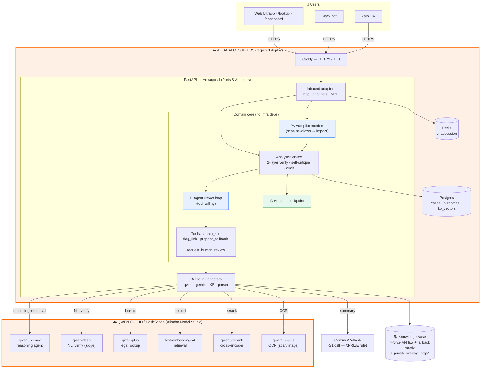
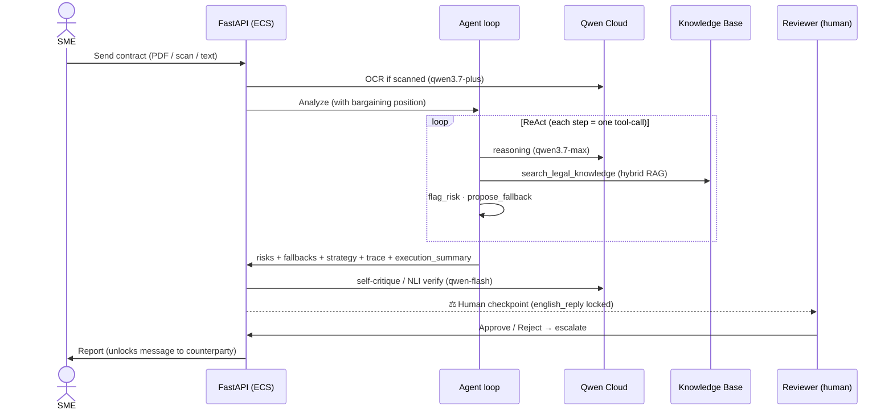

# Architecture Diagram (EN) — Legal Guard

Diagram for the Qwen Cloud Hackathon (Autopilot Agent track). Renders on GitHub; screenshot for the
Devpost submission. **Alibaba Cloud** blocks are highlighted (a track requirement). Vietnamese version:
[`architecture-diagram.md`](architecture-diagram.md).

## System overview

## Analysis flow (sequence)

## Why it fits the Autopilot Agent track
- **End-to-end autonomy** via real **tool-calling** (parse → RAG → flag risk → propose fallback → strategy), not a single prompt.
- **Self-critique**: the agent verifies its own findings (evidence-existence + NLI) before returning.
- **Proactive autopilot**: `/monitor/run` scans newly-issued laws → which past contracts are affected → self-tunes on false-alarm feedback ("works while you sleep").
- **Human-in-the-loop**: the message to the counterparty stays locked until a human approves.
- **AI-Native evidence**: `GET /runs` + per-run `execution_summary` expose the agent's tool calls & decisions.
- **Runs on Alibaba Cloud**: ECS host + Qwen Cloud/DashScope (Model Studio) for all LLM calls.
