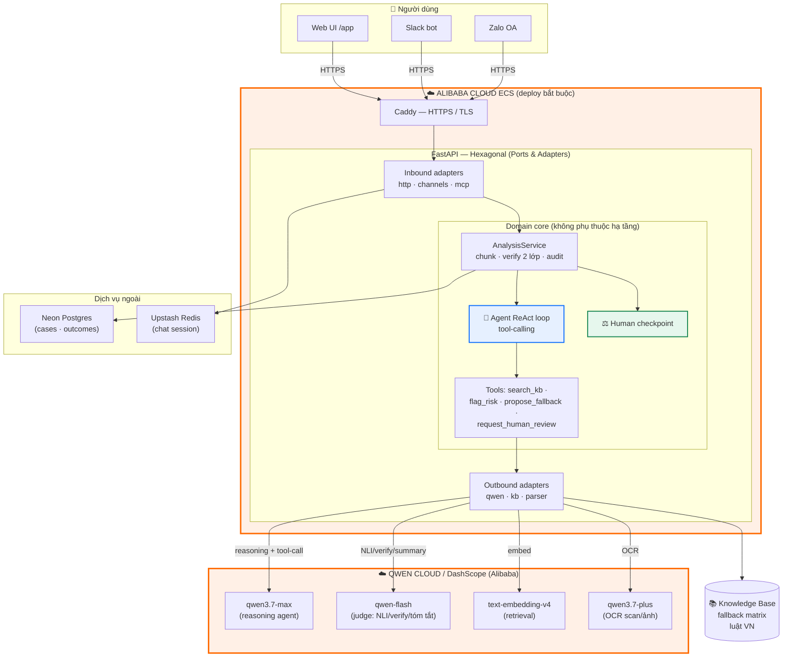
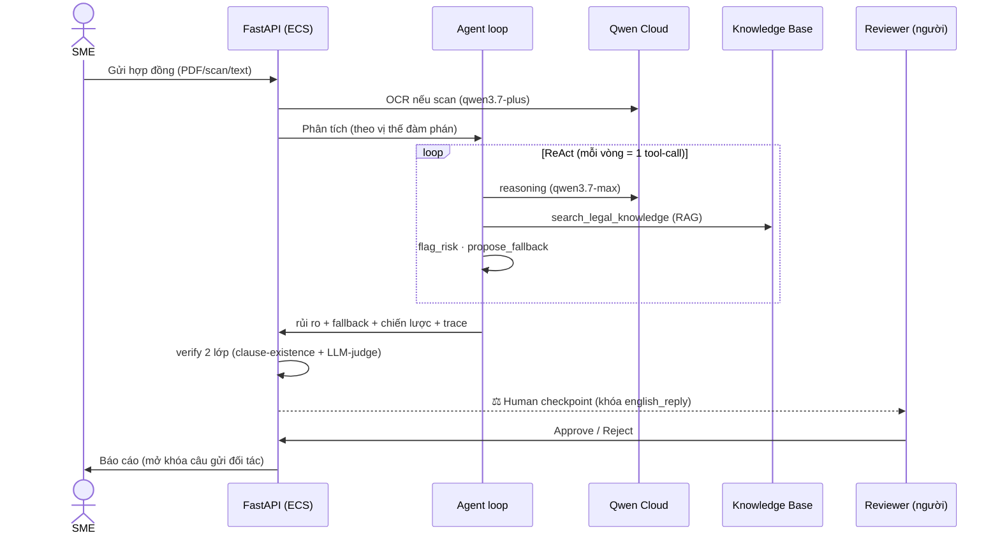

# Architecture Diagram — Legal Guard PH

Sơ đồ kiến trúc cho Qwen Hackathon (track Autopilot Agent). Render trực tiếp trên GitHub;
chụp màn hình để nộp Devpost. Phần **Alibaba Cloud** được tô đậm (yêu cầu bắt buộc của track).

## Tổng quan hệ thống

## Luồng phân tích (sequence)

## Điểm nhấn cho giám khảo Autopilot Agent
- **Agent tự động end-to-end**: parse → RAG → flag risk → propose fallback → strategy, qua **tool-calling** thật (không phải prompt đơn).
- **Human-in-the-loop checkpoint**: khuyến nghị bị khóa tới khi người duyệt — đúng tiêu chí track.
- **Chạy trên Alibaba Cloud**: ECS (host) + Qwen Cloud/DashScope (qwen3.7-max reasoning, text-embedding-v4, qwen3.7-plus OCR).
- **Xử lý input mơ hồ**: OCR ảnh scan, adaptive routing, chunk hợp đồng dài.
